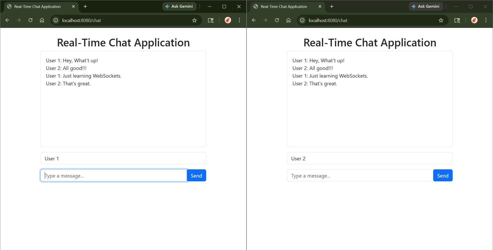

# Real-time-Chat-Application

A full-stack real-time chat application built using Spring Boot and WebSocket (STOMP protocol) that enables instant communication between users with a responsive UI.

🚀 Features
🔄 Real-time messaging using WebSockets
👤 One-to-one chat functionality
🟢 Online/offline user status
✍️ Typing indicators (optional if implemented)
💾 Message handling via STOMP protocol
🎨 Responsive UI with Bootstrap
⚡ Fast client-server communication using SockJS

🛠️ Tech Stack
🖥️ Backend
Spring Boot
Spring WebSocket
Spring Messaging (STOMP Protocol)
Thymeleaf

🎨 Frontend
Thymeleaf (Server-side rendering)
JavaScript (ES6)
SockJS
STOMP.js
HTML5, CSS3
Bootstrap

⚙️ Build Tools
Maven / Gradle

🧠 How It Works
1. The client establishes a WebSocket connection with the server using SockJS.
2. STOMP protocol is used for sending and receiving messages.
3. Messages are routed through Spring’s messaging system.
4. Thymeleaf dynamically renders UI on the server side.
5. JavaScript handles real-time updates without page reload.

⚙️ Setup & Run
1️⃣ Clone the repository
git clone https://github.com/PreetG3/Real-time-Chat-Application.git
2️⃣ Run the application
Using Maven: mvn spring-boot:run

## 📸 Screenshots
### Real-Time Chat UI

🌐 Access the App
Open your browser and go to:
http://localhost:8080/chat

🚧 Future Improvements
🔐 User authentication (JWT / Spring Security)
💬 Group chat support
🗄️ Database integration (MySQL / MongoDB)
📱 Mobile responsiveness improvements
☁️ Deployment (AWS / Render / Railway)

🤝 Contributing
Contributions are welcome! Feel free to fork the repo and submit a pull request.
